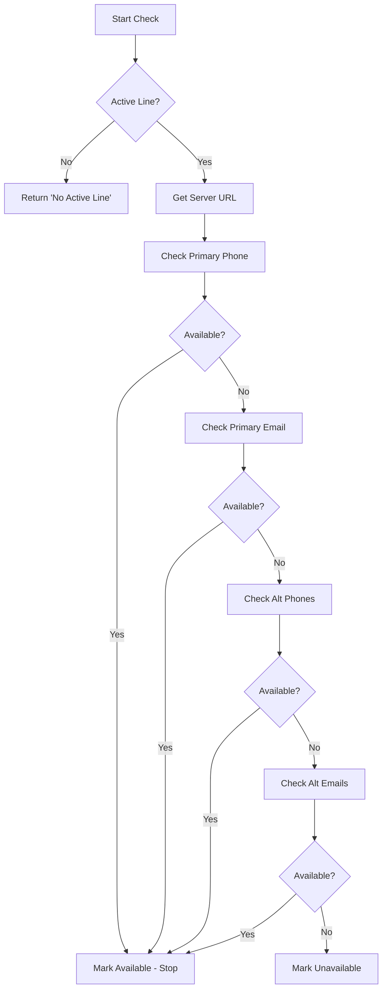

## Overview

Verify whether a lead's phone number or email supports iMessage before sending messages. The system automatically checks all new leads and provides manual re-check options.

<Info>
iMessage availability checking helps you send messages through the optimal channel and avoid delivery failures.
</Info>

---

## Automatic Checking

When you upload leads, the system automatically checks availability:

<Steps>
  <Step title="Upload Detection">
    System detects new leads from upload
  </Step>
  <Step title="Address Check">
    Automatically checks **all phone and email addresses**
  </Step>
  <Step title="Status Update">
    Updates lead record with availability status
  </Step>
</Steps>

### Status Indicators

| Icon | Status | Description |
|------|--------|-------------|
| 🔵 | **Available** | Supports iMessage (blue bubble) |
| ⚪ | **Unavailable** | Does not support iMessage (SMS/email only) |
| 🔄 | **Checking** | Currently verifying |
| ⚠️ | **Error** | Check failed - retry available |
| ⭕ | **No Active Line** | Configure a line first |

---

## Manual Checking

### Single Lead Check

Check availability for individual leads:

1. Navigate to **Leads** page
2. Find the lead in the table
3. Click **Check Availability** button
4. Status updates in real-time

<Tip>
Re-check leads periodically as contacts may enable or disable iMessage on their devices.
</Tip>

### Bulk Checking

Check multiple leads at once:

1. Select multiple leads using checkboxes
2. Click **Check Availability** (bulk action in toolbar)
3. System checks all selected leads
4. Progress indicator shows completion

<Note>
Bulk checking is processed sequentially to avoid rate limiting. Large batches may take a few minutes.
</Note>

---

## Quick Send Preview

Get instant availability feedback when composing quick messages:

<Steps>
  <Step title="Open Quick Send">
    Navigate to **Leads → Import** and click **Quick Send**
  </Step>
  <Step title="Enter Recipient">
    Type phone number or email address
  </Step>
  <Step title="Auto-Check">
    System automatically checks availability (500ms debounce)
  </Step>
  <Step title="View Status">
    See availability icon next to recipient field
  </Step>
</Steps>

### Status Icons

- 🔵 **Blue circle** - iMessage available
- ⚪ **Gray circle** - Not available (will send as SMS/email)
- ⏳ **Spinner** - Checking...

---

## How It Works

Understanding the availability check process:



### Check Priority

The system checks addresses in this order and stops at the first available one:

1. Primary phone
2. Primary email
3. Alternate phone 1
4. Alternate phone 2
5. Alternate phone 3
6. Alternate email 1
7. Alternate email 2
8. Alternate email 3

<Info>
Checking stops at the **first available** address to optimize performance.
</Info>

---

## Requirements

Before checking availability, you must have an active line configured:

<Warning>
**Important:** Without an active line, all checks will show "No Active Line" status.
</Warning>

### Setup Required

1. Navigate to **Lines** page
2. Purchase or configure a line
3. Ensure line status is **Active**
4. Line must have a valid **Server URL**

<Card title="Configure Lines" icon="phone" href="/features/lines">
  Learn how to set up and manage your messaging lines
</Card>

---

## API Reference

### Check Single Lead

Check availability for a specific lead by ID.

```bash
GET /api/leads/check-availability?id={leadId}
```

**Response:**

```json
{
  "success": true,
  "leadId": "507f1f77bcf86cd799439011",
  "available": true,
  "status": "available"
}
```

---

### Check Multiple Leads

Batch check multiple leads at once.

```bash
POST /api/leads/check-availability
```

**Request:**

```json
{
  "leadIds": [
    "507f1f77bcf86cd799439011",
    "507f1f77bcf86cd799439012",
    "507f1f77bcf86cd799439013"
  ]
}
```

**Response:**

```json
{
  "success": true,
  "checked": 3,
  "successful": 3,
  "errors": 0,
  "results": [
    {
      "leadId": "507f1f77bcf86cd799439011",
      "available": true,
      "status": "available"
    },
    {
      "leadId": "507f1f77bcf86cd799439012",
      "available": false,
      "status": "unavailable"
    },
    {
      "leadId": "507f1f77bcf86cd799439013",
      "available": true,
      "status": "available"
    }
  ]
}
```

---

### Check Individual Address

Check availability for a phone or email address (Quick Send).

```bash
POST /api/leads/check-availability
```

**Request:**

```json
{
  "address": "+12025551234"
}
```

**Response:**

```json
{
  "success": true,
  "available": true,
  "address": "+12025551234"
}
```

### Error Codes

| Code | Description |
|------|-------------|
| `400` | No active line configured |
| `401` | Unauthorized - invalid or missing token |
| `404` | Lead not found |
| `500` | Server error - check failed |

---

## Best Practices

<AccordionGroup>
  <Accordion title="🔄 Regular Re-checks" icon="rotate">
    Re-check leads periodically (weekly/monthly) as people change devices and enable/disable iMessage
  </Accordion>
  
  <Accordion title="⚡ Bulk for Efficiency" icon="bolt">
    Use bulk checking for large lists to save time and ensure all leads are current
  </Accordion>
  
  <Accordion title="✅ Check Before Campaigns" icon="circle-check">
    Always verify availability before launching messaging campaigns to maximize deliverability
  </Accordion>
  
  <Accordion title="📊 Monitor Error Rates" icon="chart-line">
    If you see high error rates, verify your line configuration and server URL
  </Accordion>
</AccordionGroup>

---

## Troubleshooting

<AccordionGroup>
  <Accordion title="❌ 'No Active Line' Status" icon="exclamation-circle">
    **Solution:** Configure an active line in Settings → Lines before checking availability.
  </Accordion>
  
  <Accordion title="⚠️ Check Failed Errors" icon="triangle-exclamation">
    **Solution:** Verify your server URL is correct and accessible. Check network connectivity.
  </Accordion>
  
  <Accordion title="🔄 Stuck on 'Checking'" icon="spinner">
    **Solution:** Refresh the page. If issue persists, check your line's server status.
  </Accordion>
</AccordionGroup>

