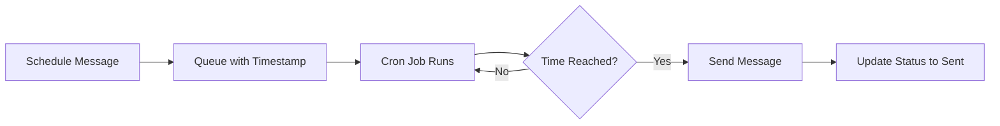

## Overview

Send iMessage, SMS, or email to leads or arbitrary recipients. Messages can be sent immediately or scheduled for later delivery.

<CardGroup cols={2}>
  <Card title="Quick Send" icon="bolt" href="#quick-send">
    Send one-off messages without creating leads
  </Card>
  <Card title="Send to Leads" icon="users" href="#send-to-leads">
    Campaign messages and bulk outreach
  </Card>
</CardGroup>

---

## Quick Send

Perfect for testing, one-off messages, or contacting people not in your system.

<Info>
**No lead required** - Send directly to any phone or email address
</Info>

### How to Quick Send

<Steps>
  <Step title="Open Quick Send">
    Navigate to **Leads → Import** and click **Quick Send** button
  </Step>
  
  <Step title="Enter Recipient">
    Type recipient address:
    - **Phone:** Include country code (e.g., +12025551234)
    - **Email:** Full email address
  </Step>
  
  <Step title="Check Availability">
    System **automatically checks** iMessage availability:
    - 🔵 Blue icon - iMessage available
    - ⚪ Gray icon - Will send as SMS/email
  </Step>
  
  <Step title="Compose Message">
    Type your message in the text area
  </Step>
  
  <Step title="Choose Timing">
    Select delivery time:
    - **Send Now** - Immediate delivery
    - **Send Later** - Schedule for specific date/time
  </Step>
  
  <Step title="Send">
    Click **Send Now** or **Schedule Message**
  </Step>
</Steps>

### Limitations

<Warning>
- Cannot send to unavailable addresses (button will be disabled)
- Must have an active line configured
- Message length limits apply based on type
</Warning>

---

## Send to Leads

The recommended method for campaigns, follow-ups, and organized outreach.

### Single Lead Message

Send to one lead at a time:

1. Navigate to **Leads** page
2. Find and select a lead (checkbox)
3. Click **Send Message** in toolbar
4. Compose and configure message
5. Click **Send**

### Bulk Messaging

Send to multiple leads simultaneously:

<Steps>
  <Step title="Select Leads">
    Check multiple leads in the table
  </Step>
  
  <Step title="Open Message Composer">
    Click **Send Message** (bulk action)
  </Step>
  
  <Step title="Compose Message">
    Type your message (same for all recipients)
  </Step>
  
  <Step title="Choose Message Type">
    System automatically selects optimal type:
    - **iMessage** - If available
    - **SMS** - Fallback for unavailable iMessage
    - **Email** - Email delivery
  </Step>
  
  <Step title="Set Timing">
    Choose immediate or scheduled delivery
  </Step>
  
  <Step title="Send Batch">
    Click **Send** - progress indicator shows completion
  </Step>
</Steps>

<Info>
**Batch Processing:** Messages are sent sequentially with individual delivery status per lead.
</Info>

---

## Message Types

Choose the right message type for your communication:

<CardGroup cols={3}>
  <Card title="iMessage" icon="message">
    **Blue bubble**
    
    Apple iMessage delivery
    
    Requires: iMessage enabled
  </Card>
  
  <Card title="SMS" icon="mobile">
    **Green bubble**
    
    Standard text message
    
    Requires: Any mobile number
  </Card>
  
  <Card title="Email" icon="envelope">
    **Email delivery**
    
    Email client delivery
    
    Requires: Valid email address
  </Card>
</CardGroup>

<Tip>
The system **automatically selects** the best delivery method based on availability checks.
</Tip>

---

## Scheduling Messages

Send messages at the perfect time, even when you're not available.

### Schedule for Later

<Steps>
  <Step title="Select 'Send Later'">
    Choose the scheduling option when composing
  </Step>
  
  <Step title="Pick Date">
    Use calendar picker to select date
  </Step>
  
  <Step title="Pick Time">
    Use time picker for specific hour/minute
  </Step>
  
  <Step title="Validation">
    System validates:
    - Must be future date/time
    - Cannot be in the past
  </Step>
  
  <Step title="Queue Message">
    Message saved with **Scheduled** status
  </Step>
</Steps>

### How Scheduled Messages Work



<Note>
**Processing:** Scheduled messages are processed by a cron job that runs every minute.
</Note>

### Managing Scheduled Messages

View and manage your scheduled messages:

1. Navigate to **Messages** page
2. Filter by status: **Scheduled**
3. Can cancel messages before send time
4. Edit or reschedule as needed

---

## Message Tracking

Every message includes comprehensive tracking data:

### Message Properties

<ParamField path="status" type="string">
  Current message state:
  - `Sent` - Successfully delivered
  - `Scheduled` - Queued for future send
  - `Failed` - Delivery failed
  - `Cancelled` - Manually cancelled
</ParamField>

<ParamField path="timestamp" type="datetime">
  When message was sent or scheduled
</ParamField>

<ParamField path="recipient" type="object">
  Lead reference or direct address
</ParamField>

<ParamField path="fromLine" type="string">
  Which line sent the message
</ParamField>

<ParamField path="messageType" type="string">
  iMessage, SMS, or Email
</ParamField>

<ParamField path="batchId" type="string">
  For bulk sends - links related messages
</ParamField>

### View Message History

Access complete message logs:

1. Navigate to **Messages** page
2. Use filters:
   - Status
   - Date range
   - Message type
   - Recipient
3. Search by content or recipient name
4. Export for analysis

---

## API Reference

Send messages programmatically via REST API.

### Send Message Endpoint

```bash
POST /api/messages
```

**Headers:**

```json
{
  "Content-Type": "application/json",
  "Authorization": "Bearer <clerk_token>"
}
```

**Request Body:**

```json
{
  "message": "Hello! This is a test message.",
  "messageType": "imessage",
  "fromLineId": "507f1f77bcf86cd799439011",
  "recipientPhone": "+12025551234",
  "recipientName": "John Doe",
  "scheduledDate": "2025-10-15T14:30:00Z",
  "leadId": "507f1f77bcf86cd799439012"
}
```

### Request Parameters

<ParamField path="message" type="string" required>
  Message text content
</ParamField>

<ParamField path="messageType" type="string" required>
  One of: `imessage`, `sms`, or `email`
</ParamField>

<ParamField path="fromLineId" type="string" required>
  ID of the line to send from
</ParamField>

<ParamField path="recipientPhone" type="string">
  Phone number (required if no recipientEmail)
</ParamField>

<ParamField path="recipientEmail" type="string">
  Email address (required if no recipientPhone)
</ParamField>

<ParamField path="recipientName" type="string">
  Display name for recipient
</ParamField>

<ParamField path="scheduledDate" type="datetime">
  ISO 8601 timestamp for scheduled delivery
</ParamField>

<ParamField path="leadId" type="string">
  Associated lead ID (optional)
</ParamField>

<ParamField path="batchId" type="string">
  Batch identifier for bulk operations
</ParamField>

**Response:**

```json
{
  "success": true,
  "message": {
    "_id": "507f1f77bcf86cd799439013",
    "message": "Hello! This is a test message.",
    "messageType": "imessage",
    "status": "sent",
    "createdAt": "2025-10-14T10:30:00Z"
  }
}
```

### Error Codes

| Code | Description |
|------|-------------|
| `400` | Missing required fields or invalid data |
| `401` | Unauthorized - invalid or missing token |
| `404` | Lead or line not found |
| `500` | Server error - delivery failed |

<Card title="Complete API Docs" icon="book" href="/api-reference/messages">
  View detailed API documentation with more examples
</Card>

---

## Best Practices

### ✅ Do's

<AccordionGroup>
  <Accordion title="Check Availability First" icon="circle-check">
    Always verify iMessage availability before bulk sending to maximize delivery rates
  </Accordion>
  
  <Accordion title="Use Scheduling Wisely" icon="clock">
    Schedule messages for optimal times based on your audience's timezone and habits
  </Accordion>
  
  <Accordion title="Personalize Messages" icon="user">
    Use lead data to personalize messages and increase engagement
  </Accordion>
  
  <Accordion title="Test First" icon="flask">
    Use Quick Send to test messages before launching full campaigns
  </Accordion>
  
  <Accordion title="Monitor Delivery" icon="chart-line">
    Regularly check delivery status and adjust strategy based on results
  </Accordion>
</AccordionGroup>

### ❌ Don'ts

<Warning>
**Avoid these common mistakes:**

- ❌ Sending to unchecked addresses
- ❌ Spamming recipients with multiple messages
- ❌ Sending without an active line configured
- ❌ Using all caps or excessive punctuation
- ❌ Sending promotional content without consent
- ❌ Ignoring delivery failures and errors
</Warning>

---

## Troubleshooting

<AccordionGroup>
  <Accordion title="Message Failed to Send" icon="circle-exclamation">
    **Common causes:**
    - Recipient address is invalid
    - Line is not active or misconfigured
    - Server connection issue
    
    **Solution:** Verify recipient address, check line status, and retry
  </Accordion>
  
  <Accordion title="Scheduled Message Didn't Send" icon="calendar-xmark">
    **Common causes:**
    - Line became inactive
    - Server was down at scheduled time
    - Message was cancelled
    
    **Solution:** Check message status in Messages page, verify line is active
  </Accordion>
  
  <Accordion title="Cannot Send to Unavailable Address" icon="ban">
    **Cause:** Recipient doesn't support iMessage and message type is set to iMessage only
    
    **Solution:** Change message type to SMS or Email, or use auto-select mode
  </Accordion>
</AccordionGroup>

